# ISTQB Practice Q&A Platform - System Flowcharts

## Table of Contents
1. [Overall System Architecture](#1-overall-system-architecture)
2. [User Authentication Flow](#2-user-authentication-flow)
3. [Quiz Taking Flow](#3-quiz-taking-flow)
4. [Question Management Flow](#4-question-management-flow)
5. [Progress Tracking Flow](#5-progress-tracking-flow)
6. [Admin Dashboard Flow](#6-admin-dashboard-flow)
7. [Achievement System Flow](#7-achievement-system-flow)

---

## 1. Overall System Architecture

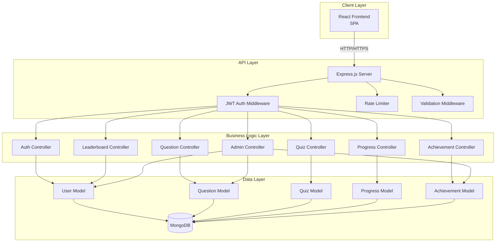

---

## 2. User Authentication Flow

### 2.1 Registration Flow

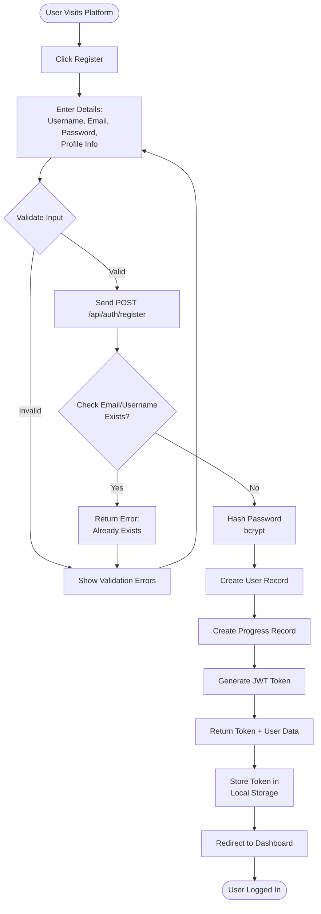

### 2.2 Login Flow

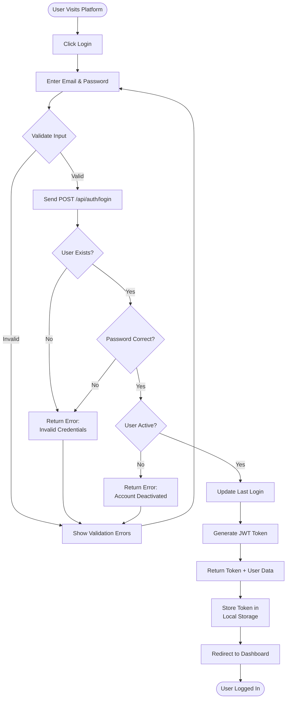

---

## 3. Quiz Taking Flow

### 3.1 Complete Quiz Flow

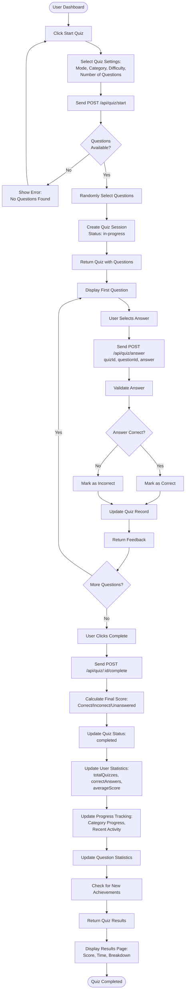

---

## 4. Question Management Flow

### 4.1 Question Creation Flow

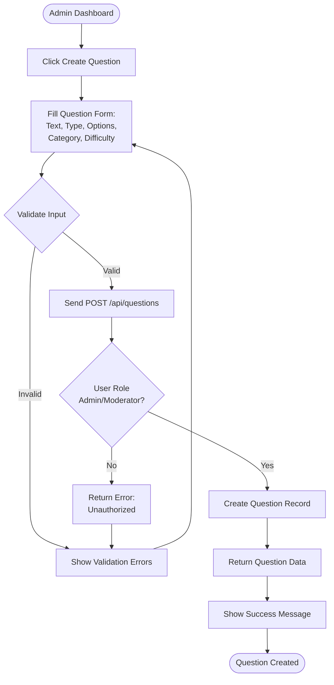

### 4.2 Question Flagging Flow

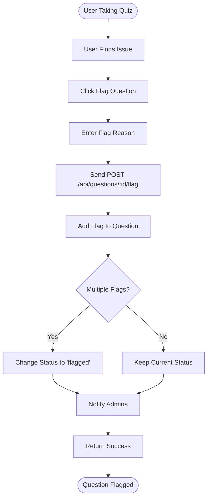

---

## 5. Progress Tracking Flow

### 5.1 Progress Update Flow

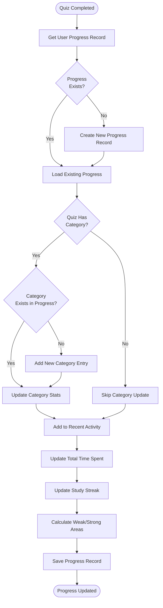

### 5.2 Study Streak Calculation

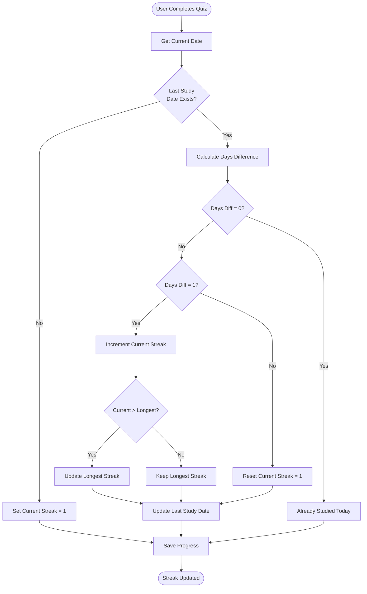

---

## 6. Admin Dashboard Flow

### 6.1 User Management Flow

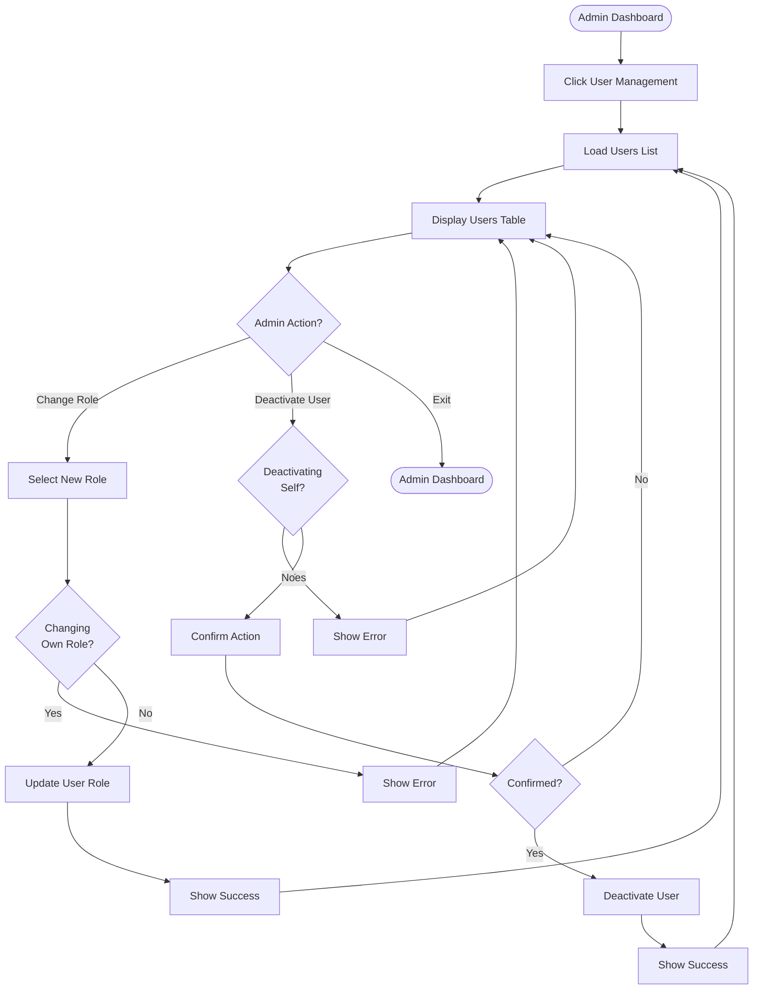

### 6.2 Question Review Flow

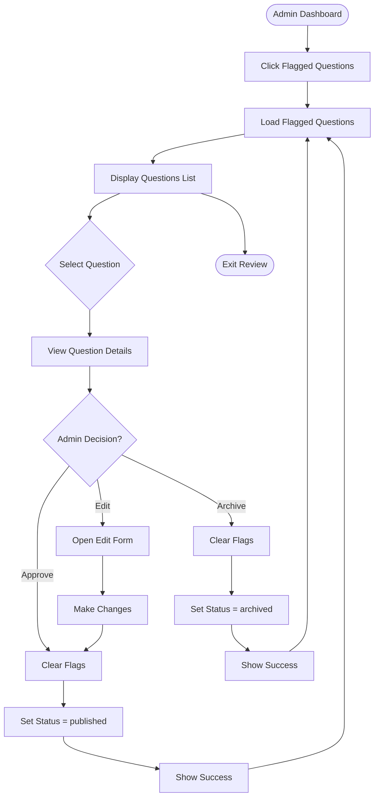

---

## 7. Achievement System Flow

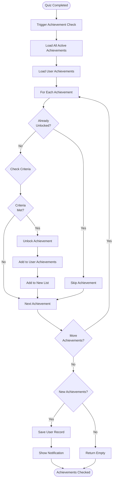

---

## 8. Error Handling Flow

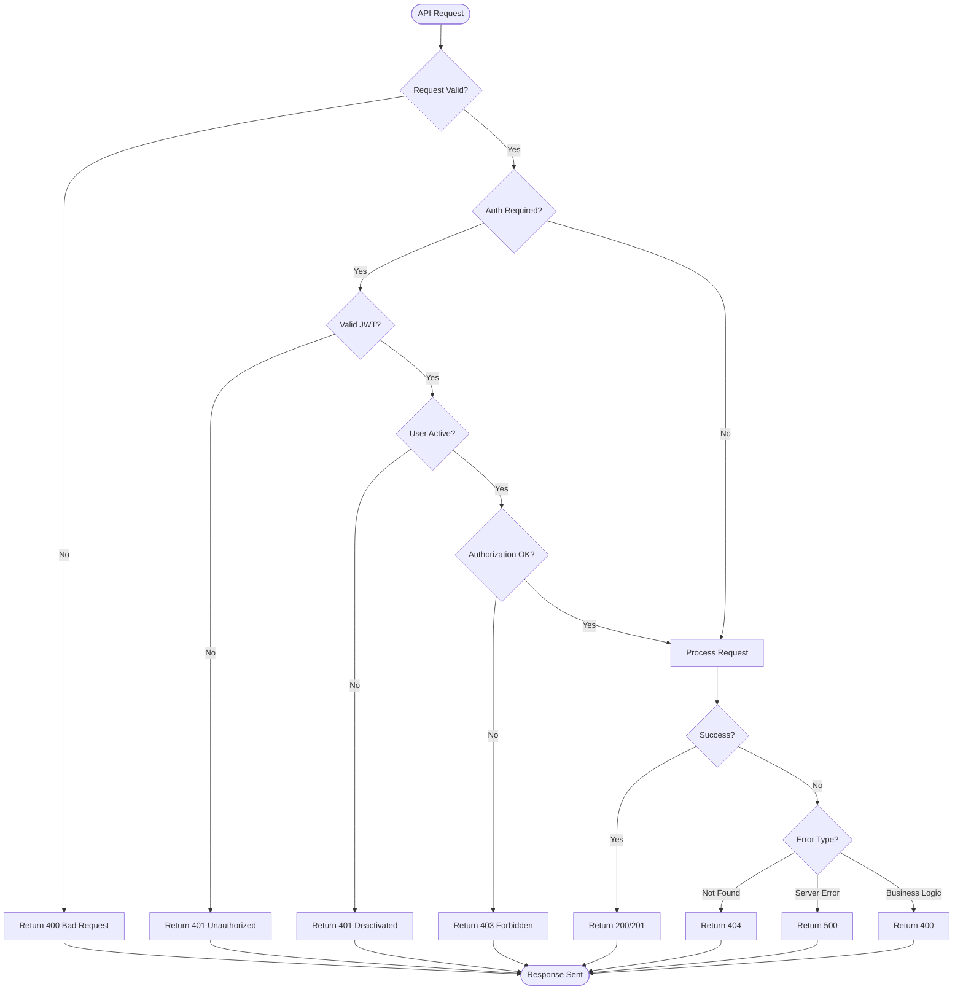

---

**Document Version**: 1.0  
**Last Updated**: November 8, 2024  
**Created for**: ISTQB Practice Q&A Platform